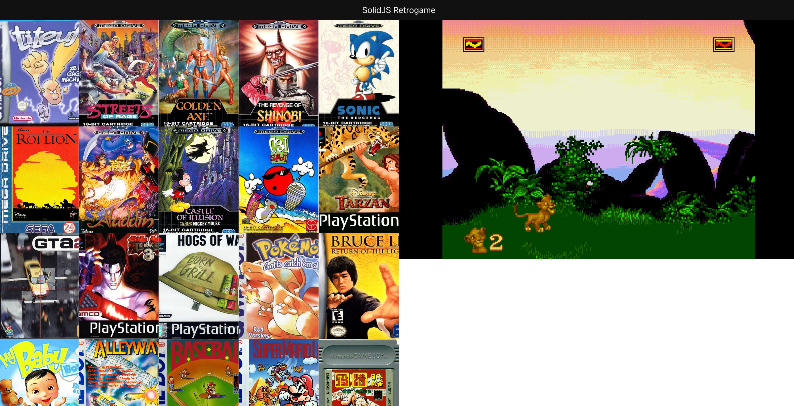

<p align="center">
    
</p>

## solidjs-retrogame

SolidJS-Retrogame is a retro game platform developed with the SolidJS library

## Author

- [Elmahdi KORFED](https://github.com/elmahdik)

## Project setup instructions

How to play ?

1/ Go to back folder :

```
cd back
npm run start
```

2/ Go to front folder :

```
cd front
npm run dev
```

---

3/ Bonus : How to add a new game ?

Open & edit this file to add a new game :

```
cd back/data/db.json
```

Have fun ! 😎 🎮
